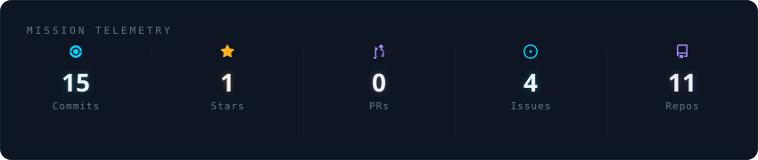

  

 

  

 

  

<strong>More about me</strong>

 

Building practical tools around AI agents, data systems, and automation. Turning useful ideas into local-first assistants, browser tools, and data products.

**Focus Areas**
- 🤖 **AI Agents**: AgentScope, MCP, local-first assistants, and tool-using workflows
- 🧱 **Data Engineering**: Spark, Delta Lake, MinIO, PostgreSQL, and Docker
- 🕸️ **Web Products**: TypeScript, React, Next.js, and Cloudflare
- ⚙️ **Automation**: Browser extensions, Playwright, crawlers, and practical RPA

**Contact**
- 🐙 GitHub: [github.com/YifanL00](https://github.com/YifanL00)

 

<h2 align="center">Weekly Coding Activity</h2>

<!--START_SECTION:waka-->
<!--END_SECTION:waka-->

 

<h2 align="center">Contribution Snake</h2>

  <picture>
    <source
      media="(prefers-color-scheme: dark)"
      srcset="https://raw.githubusercontent.com/YifanL00/YifanL00/output/github-contribution-grid-snake-dark.svg"
    />
    <source
      media="(prefers-color-scheme: light)"
      srcset="https://raw.githubusercontent.com/YifanL00/YifanL00/output/github-contribution-grid-snake.svg"
    />
    
  </picture>

 

  
  

 

  <samp>Thanks for visiting — let's build useful things.</samp>

<!-- Profile SVGs auto-generated by galaxy-profile -->
