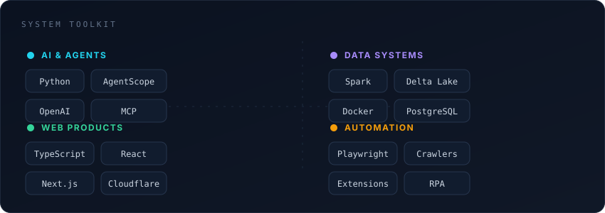

  

 

  
  
  

 

  

<strong>More about me / 关于我</strong>

 

I build practical tools around AI agents, data infrastructure and automation — from local-first assistants and browser extensions to data lakehouses and polished web products.

我喜欢把 AI Agent、数据工程与自动化真正做成可用的产品：从本地智能助手、浏览器扩展，到数据湖与移动端 Web 工具。

- 🤖 **AI Agents** — AgentScope, MCP, local-first assistants and agent workflows
- 🧱 **Data Engineering** — Spark, Delta Lake, MinIO, PostgreSQL and Docker
- 🕸️ **Web & Automation** — TypeScript, React, Next.js, Cloudflare and browser automation
- 🧪 **Currently exploring** — smaller agents, reliable tool use and useful human-in-the-loop systems

 

<h2 align="center">Selected Projects</h2>

<table>
  <tr>
    <td width="50%" valign="top">
      <h3><a href="https://github.com/YifanL00/CodexPet">🐾 CodexPet</a></h3>
      
A cross-platform Codex v2 pet pack with independent Linux and Windows desktop companions.

      
<code>Python</code> <code>PowerShell</code> <code>GTK</code>

    </td>
    <td width="50%" valign="top">
      <h3><a href="https://github.com/YifanL00/x-video-saver">📱 X Video Saver</a></h3>
      
A mobile-first PWA for saving public X videos on iPhone through the native share sheet.

      
<code>TypeScript</code> <code>React</code> <code>Next.js</code> <code>Cloudflare</code>

    </td>
  </tr>
  <tr>
    <td width="50%" valign="top">
      <h3><a href="https://github.com/YifanL00/job-claw">🦞 JobClaw</a></h3>
      
An AI-powered job-search workspace for resume analysis, job matching and assisted outreach.

      
<code>AI</code> <code>Chrome Extension</code> <code>Automation</code>

    </td>
    <td width="50%" valign="top">
      <h3><a href="https://github.com/YifanL00/spark-lakehouse">🌊 Spark Lakehouse</a></h3>
      
A Docker Compose lakehouse stack with Spark, Delta Lake, MinIO, Hive and Kyuubi.

      
<code>Spark</code> <code>Delta Lake</code> <code>Docker</code> <code>SQL</code>

    </td>
  </tr>
</table>

 

<h2 align="center">GitHub Telemetry</h2>

  <picture>
    <source height="170" media="(prefers-color-scheme: dark)" srcset="https://github-readme-stats.vercel.app/api?username=YifanL00&show_icons=true&hide_border=true&bg_color=0b1220&title_color=22d3ee&icon_color=a78bfa&text_color=cbd5e1&ring_color=22d3ee" />
    <source height="170" media="(prefers-color-scheme: light)" srcset="https://github-readme-stats.vercel.app/api?username=YifanL00&show_icons=true&hide_border=true&bg_color=f6f8fa&title_color=087ea4&icon_color=8250df&text_color=1f2328&ring_color=087ea4" />
    
  </picture>
  <picture>
    <source height="170" media="(prefers-color-scheme: dark)" srcset="https://github-readme-stats.vercel.app/api/top-langs/?username=YifanL00&layout=compact&hide_border=true&bg_color=0b1220&title_color=22d3ee&text_color=cbd5e1" />
    <source height="170" media="(prefers-color-scheme: light)" srcset="https://github-readme-stats.vercel.app/api/top-langs/?username=YifanL00&layout=compact&hide_border=true&bg_color=f6f8fa&title_color=087ea4&text_color=1f2328" />
    
  </picture>

 

<h2 align="center">Contribution Orbit</h2>

  <picture>
    <source media="(prefers-color-scheme: dark)" srcset="https://raw.githubusercontent.com/YifanL00/YifanL00/output/github-contribution-grid-snake-dark.svg" />
    <source media="(prefers-color-scheme: light)" srcset="https://raw.githubusercontent.com/YifanL00/YifanL00/output/github-contribution-grid-snake.svg" />
    
  </picture>

 

  

 

  <samp>Build small. Learn fast. Ship useful things.</samp>

